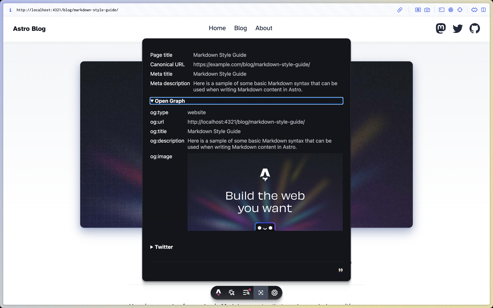

# Astro Meta Tags



Astro Meta Tags is an
[Astro Dev Toolbar App](https://docs.astro.build/en/reference/dev-toolbar-app-reference/)
that helps with making sure your site has the correct meta tags for social media
sites like X, Facebook and more.

## Installation

To install Astro Meta Tags, run the following command with your preferred
package manager:

```sh
npx astro add astro-meta-tags
```

## Usage

```ts
import { defineConfig } from "astro/config";

import astroMetaTags from "astro-meta-tags";

export default defineConfig({
  integrations: [astroMetaTags()],
});
```

## Configuration

Astro Meta Tags doesn't have any configuration options at the moment, if you
would like to see a configuration option added, please open an issue 😊
